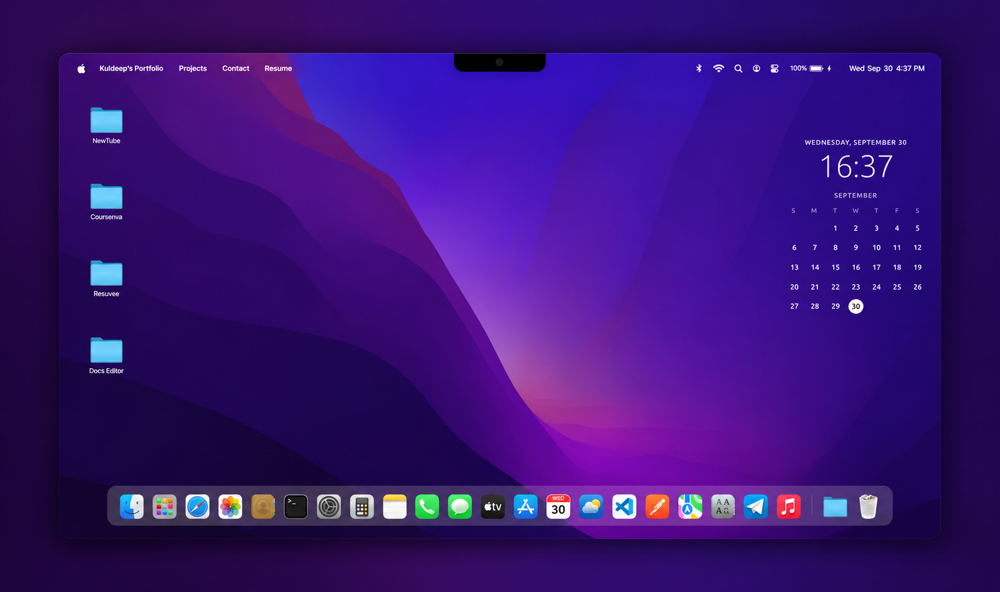

<div align="center">
  

# macOS Portfolio

**Kuldeep Rajput's interactive portfolio, built as a macOS-inspired desktop.**

[](https://nextjs.org/)
[](https://react.dev/)
[](https://developer.mozilla.org/en-US/docs/Web/JavaScript)
[](https://tailwindcss.com/)
[](https://gsap.com/)
[](https://zustand.docs.pmnd.rs/)
<br />
[](https://immerjs.github.io/immer/)
[](https://lucide.dev/)
[](https://github.com/wojtekmaj/react-pdf)
[](https://xtermjs.org/)
[](https://groq.com/)
[](./LICENSE)
</div>

---

## About

Explore Kuldeep's work through project folders, app windows, a dock, and desktop widgets. The interface includes a mobile layout while keeping the feel of a macOS desktop.

## Preview

<p align="center">
  
</p>

## Video Walkthrough

<!-- Upload the video to GitHub and paste its generated link here. -->

## Features

- Open project folders for NewTube, Coursenva, Resuvee, and Docs Editor
- Move folders, windows, widgets, and dock icons around the desktop
- Change wallpapers and add or resize widgets from the desktop menu
- Explore the résumé, terminal, notes, weather, maps, photos, and music apps
- Save a screenshot from the desktop menu bar
- Use the Groq-powered Siri assistant and the mobile interface

## Built With

- **App and styling:** Next.js 16 App Router, React 19, JavaScript, and Tailwind CSS 4 build the desktop and mobile interfaces.
- **Motion and state:** GSAP and Draggable handle movement; Zustand and Immer manage desktop and app state.
- **Interface details:** Lucide React supplies icons, Day.js handles dates, and clsx combines conditional CSS classes.
- **Desktop apps:** xterm.js powers the terminal, react-pdf displays the résumé, and html2canvas creates downloadable desktop screenshots.
- **External data:** Groq powers Siri; TMDB, Jamendo, wttr.in, OpenStreetMap, and Nominatim support the media, weather, and map apps.
- **Code quality:** ESLint, Prettier, Husky, and lint-staged support local checks and formatting.

## Run Locally

Requires Node.js 20.9 or later.

```bash
git clone https://github.com/kuldeeprajput-dev/macos-portfolio.git
cd macos-portfolio
npm install
cp .env.example .env.local
npm run dev
```

Open [http://localhost:3000](http://localhost:3000). The core desktop runs without adding API keys. Configure the optional services below for their related features.

### Configuration

- `GROQ_API_KEY` enables Siri's AI responses. Keep it server-side.
- `NEXT_PUBLIC_TMDB_API_KEY` enables movie and TV data in the Apple TV app.
- `NEXT_PUBLIC_JAMENDO_CLIENT_ID` provides music data; `.env.example` includes a public client ID.
- `NEXT_PUBLIC_GROQ_TTS_ENABLED` enables Groq voice output when your Groq account supports it.
- `SITE_URL` sets the preferred public URL for canonical links and the sitemap in production.

See [`.env.example`](./.env.example) for the remaining optional settings. Public profile and project links live in [`src/constants/env.js`](./src/constants/env.js).

## Useful Commands

```bash
npm run dev       # Start the development server
npm run build     # Build for production
npm run start     # Run the production build
npm run lint      # Check the source with ESLint
```

## Credits & Acknowledgments

- macOS interface inspiration from Apple
- [Jamendo](https://www.jamendo.com/) for music data
- [wttr.in](https://wttr.in/) for weather data
- [OpenStreetMap](https://www.openstreetmap.org/) and [Nominatim](https://nominatim.org/) for maps and geocoding
- [TMDB](https://www.themoviedb.org/) for movie and TV data
- [Groq](https://groq.com/) for Siri AI
- [GSAP](https://gsap.com/) for animations
- [xterm.js](https://xtermjs.org/) for the terminal app

## License

This project is available under the [MIT License](./LICENSE).
